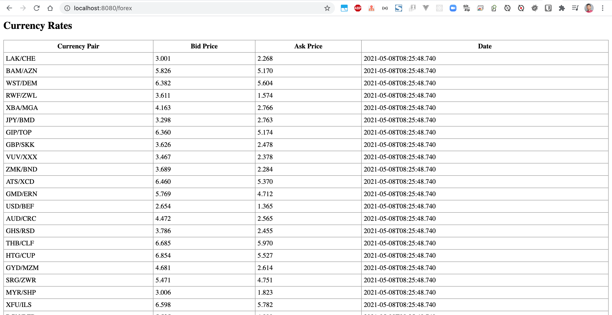

# spring-boot-mustache-demo

### Things todo list:

1. Clone this repository: `git clone https://github.com/hendisantika/spring-boot-mustache-demo.git`
2. Navigate to the folder: `cd spring-boot-mustache-demo`
3. Run the application: `mvn clean spring-boot:run`
4. Open your favorite browser: https://localhost:8080/forex

### Image screen shot

Forex Page

